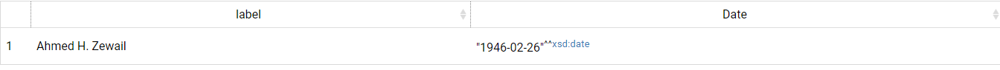
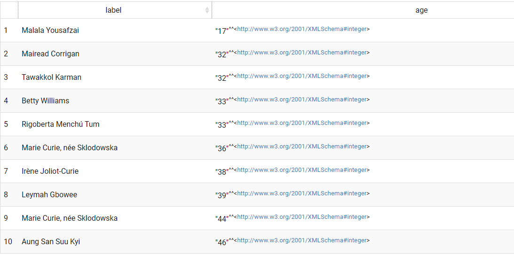

#  TP Linked Data et SparQL 
## [Soufiane BENGADI](https://www.linkedin.com/in/soufianebengadi/)
## nobelprize

## Ressources[](http://perso.ec-lyon.fr/derrode.stephane/Teaching/ECCBigData/TP1/#ressources "Permanent link")

-   Client SPARQL  [YASGUI](http://yasgui.triply.cc/)
-   [Référence SPARQL](http://www.w3.org/TR/sparql11-query/)
-   les consignes de travail [ICI](http://perso.ec-lyon.fr/derrode.stephane/Teaching/ECCBigData/index.html)

## Point d'accès Nobel prizes
-  Nobel prizes [endpoint ](http://yasgui.triply.cc/)

### query 1

La première requête a pour objectif de lister les personnes nées en  Egypte qu'ont obtenu le prix Nobel en chimie avec une date de naissance  entre le « 1940-01-01 » et « 2000-01-01 »
```
PREFIX dbpedia: <http://dbpedia.org/resource/>
PREFIX dbpprop: <http://dbpedia.org/property/>
PREFIX xsd: <http://www.w3.org/2001/XMLSchema#>
PREFIX rdfs: <http://www.w3.org/2000/01/rdf-schema#>
PREFIX dbpedia-owl: <http://dbpedia.org/ontology/>
PREFIX nobel: <http://data.nobelprize.org/terms/>
PREFIX country: <http://data.nobelprize.org/resource/country/>
PREFIX  category: <http://data.nobelprize.org/resource/category/>
SELECT DISTINCT ?label ?Date
WHERE { 
  ?laur rdfs:label ?label;
        dbpprop:dateOfBirth  ?Date.
  ?laur dbpedia-owl:birthPlace country:Egypt . 
  ?laur nobel:laureateAward ?award . 
  ?award nobel:category category:Chemistry.
  FILTER ( ?Date >= "1940-01-01"^^xsd:date ) 
FILTER (?Date < "2000-01-01"^^xsd:date) .
}
```
#### Le résultat de query
Dans la résultat en trouve Ahmed Hassan Zewail né le 26 février 1946 qui a pris le prix Nobel en chimie en 1999.
.

#### RDF de query

J'ai utilisé [Draw.io](draw.io ) pour créer les RDFs pour les deux exemples.

.

### Query 2 
La deuxième requête a  pour objectif de liste les 10 premières femmes qu’a obtenues le prix Nobel dans tous domaines confondu mais avec un ordre sur l’âge du plus jeune ou plus grand lorsqu’elles sont obtenues le prix Nobel. 

```
PREFIX foaf: <http://xmlns.com/foaf/0.1/>
PREFIX rdfs: <http://www.w3.org/2000/01/rdf-schema#>
PREFIX nobel: <http://data.nobelprize.org/terms/>
PREFIX rdf: <http://www.w3.org/1999/02/22-rdf-syntax-ns#>
PREFIX dbp: <http://dbpedia.org/property/>
SELECT  ?label ?age
WHERE { 
  ?laur rdf:type nobel:Laureate . 
  ?laur rdfs:label ?label . 
  ?laur foaf:gender "female" . 
  ?laur nobel:laureateAward ?award . 
  ?award nobel:year ?dateprize.
  ?laur dbp:dateOfBirth ?date.
  bind(?dateprize-year(?date) as ?age).
}
order by  ?age
limit 10
```
#### Le résultat de query
Dans le résultat et comme prévu en trouve Malala Yousafzai qui a obtenu le prix Nobel à 17 ans.


#### RDF de query

De même pour la deuxième requête j'ai utilisé [Draw.io](draw.io ).

.